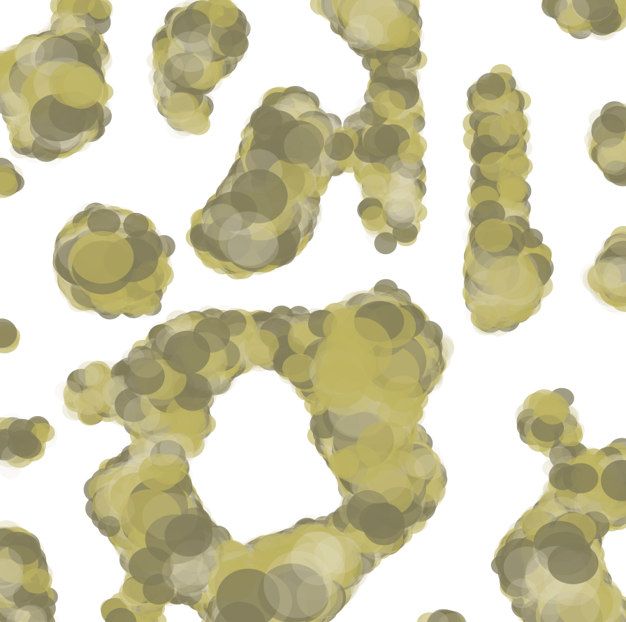
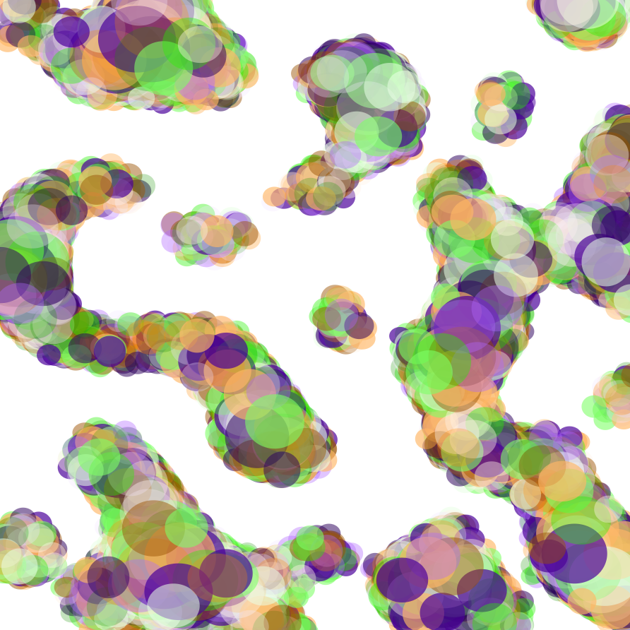
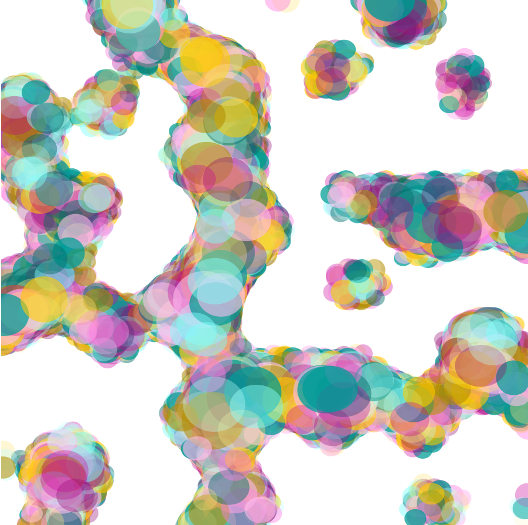
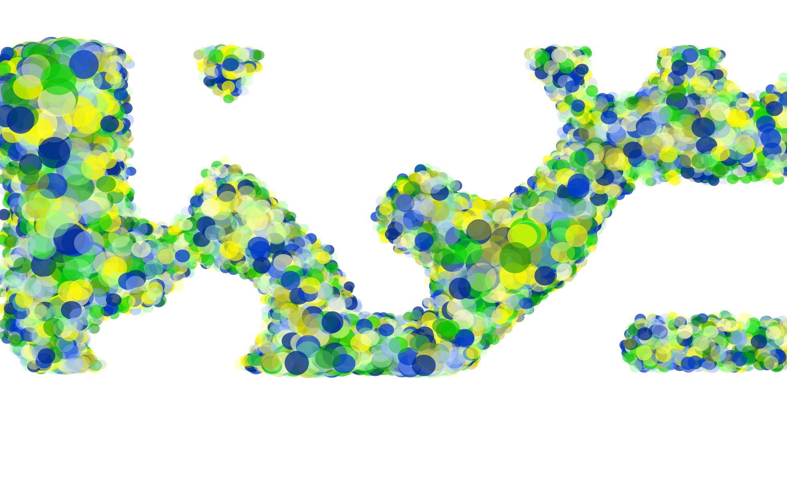
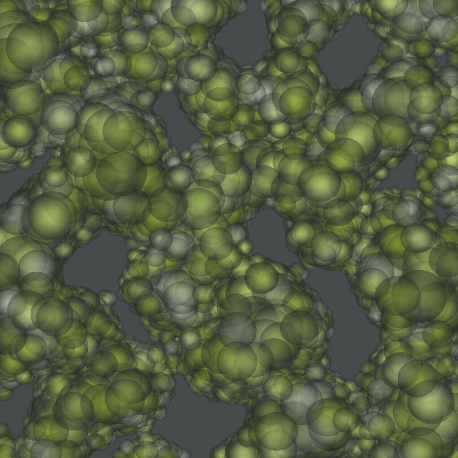
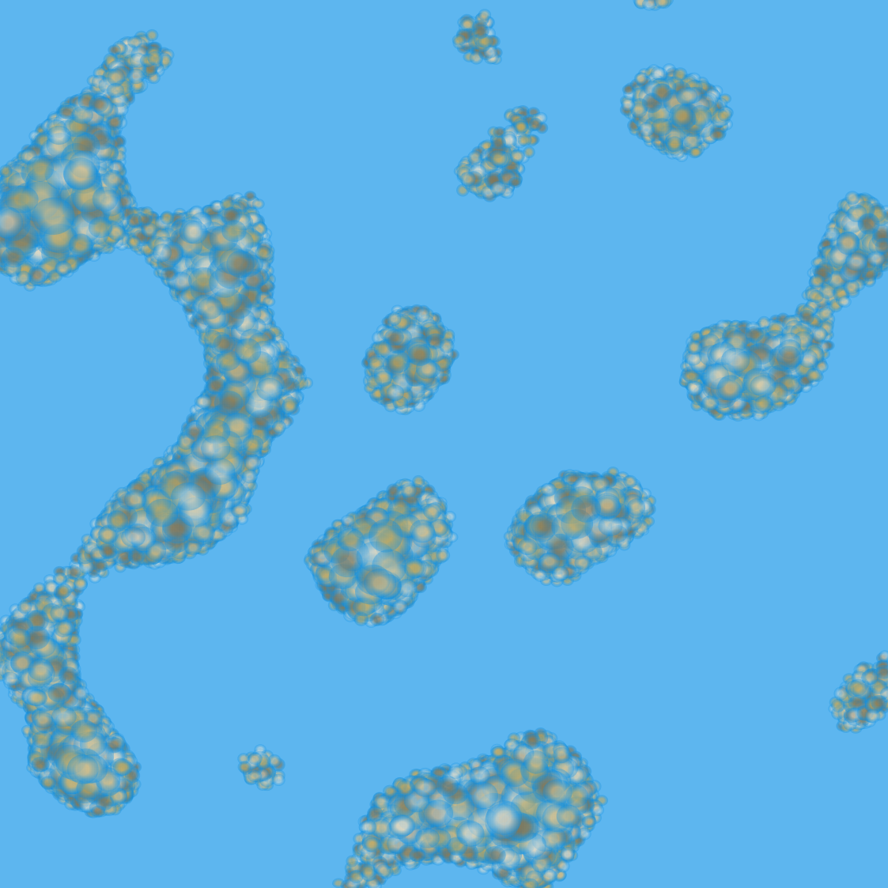
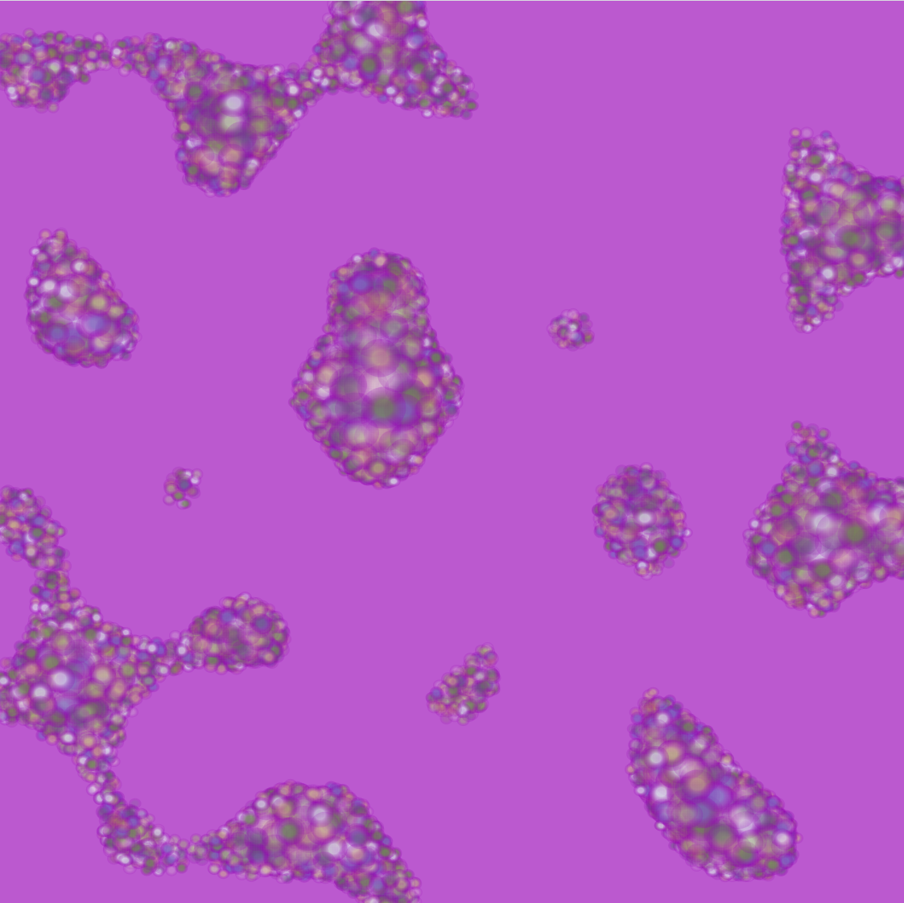

# Lights

Generate abstract light paintings in Elm.















# Development

Use [create-elm-app](https://github.com/halfzebra/create-elm-app):

```
elm-app start --no-debug
```

# License
MIT